# 🛒 Stellar Bazgit

**The Stellar-native marketplace for private GitHub repositories.**

Sell access to your private repos. Get paid in **XLM** or **USDC** on the [Stellar](https://stellar.org) network. Buyers pay once, get a time-limited `git clone` URL. AI agents can browse, buy, and list repos autonomously.

> Think of it as a paywall gateway in front of any private GitHub repo — settlement in 2–5 seconds, sub-cent fees, no credit cards, no middlemen holding your money.

### What's in a name?

**Bazgit** = **Baz** (🛒 _basket_ / _bazaar_) + **git**. A bazaar — an open marketplace — for git repositories, where every repo is an item you can drop in the basket and check out with crypto. Pair it with **Stellar**, the network that settles every sale.

The marketplace is staffed by the **🫖 TEE Agent** — your AI shopkeeper. "TEE" is a double play: it's served like a glass of Turkish _çay_ (tea), and it points at the **Trusted Execution Environment** where an agent's keys and signing can be hardware-isolated (see [TEE & Confidential Compute](#tee--confidential-compute)).

---

## Table of Contents

- [What is this?](#what-is-this)
- [The Big Picture](#the-big-picture)
- [How It Works](#how-it-works)
  - [1. Selling a repo](#1-selling-a-repo)
  - [2. Buying a repo](#2-buying-a-repo)
  - [3. The payment gateway (HTTP 402)](#3-the-payment-gateway-http-402)
  - [3b. Two payment paths: native + x402](#3b-two-payment-paths-native--standard-x402)
  - [4. The TEE Agent](#4-the-tee-agent)
  - [5. Platform fees](#5-platform-fees)
  - [6. Reviews & merchant ratings](#6-reviews--merchant-ratings)
- [Architecture](#architecture)
- [TEE & Confidential Compute](#tee--confidential-compute)
- [Tech Stack](#tech-stack)
- [API Reference](#api-reference)
- [Project Structure](#project-structure)
- [Getting Started](#getting-started)
- [Security Model](#security-model)

---

## What is this?

GitHub has no native way to **sell** access to a private repository. You either add someone as a collaborator (manual, free) or you don't.

Stellar Bazgit turns any private repo into a **pay-to-clone product**:

| Role | What they do |
|------|--------------|
| **Seller** | Connects GitHub, picks a private repo, sets a price in XLM/USDC, gets a shareable gateway URL |
| **Buyer** | Visits the listing, pays with a Stellar wallet, instantly receives an authenticated `git clone` URL |
| **AI Agent** | Discovers repos via a public API, pays autonomously from its own Stellar wallet, clones the code |

The seller's GitHub token is encrypted at rest. When a buyer pays, the server mints a short-lived clone URL using that token — the buyer never sees the raw credential, and access expires after 1 hour.

---

## The Big Picture


---

## How It Works

### 1. Selling a repo

A seller authenticates with GitHub (OAuth, scoped to `repo` access), then picks a repository to monetize.

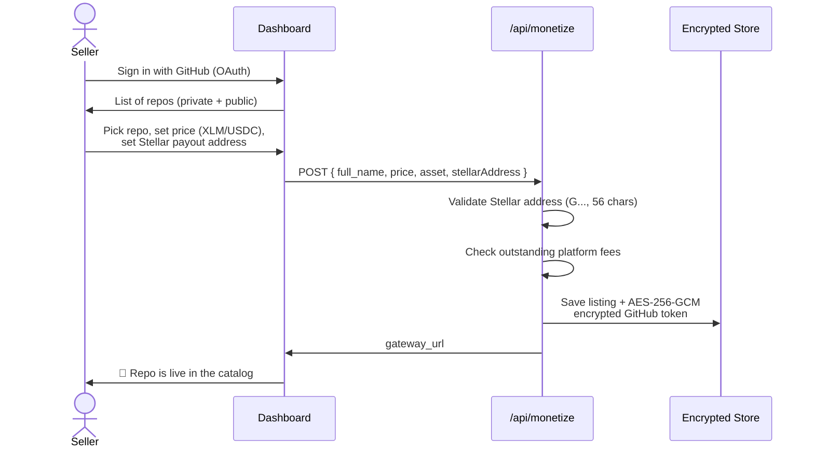

**Pricing modes:**
- **Flat** — one price unlocks the whole repo
- **Per-file / per-folder** — granular rules, each path priced independently

**Payout options:**
- **Single address** — all payments to one Stellar account
- **Split by contributors** — define shares per GitHub contributor (each with their own Stellar address)

### 2. Buying a repo

The buyer pays directly to the seller's Stellar address using the **Freighter** browser wallet. The whole flow is one button click.

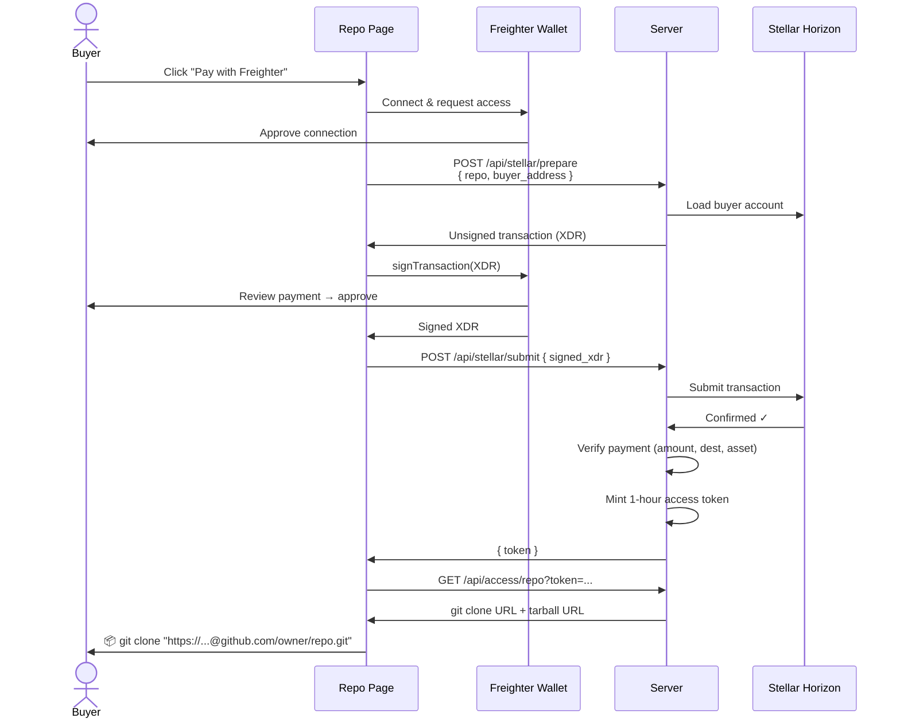

> **Why build the transaction on the server?** The Stellar SDK pulls in Node.js-only modules that don't bundle for the browser. So the server constructs the unsigned transaction; the browser only signs it via Freighter. The buyer's secret key never leaves their wallet.

### 3. The payment gateway (HTTP 402)

The gateway speaks the standard **`402 Payment Required`** status code. Hit any monetized repo's access endpoint without a token, and you get back machine-readable payment instructions — perfect for scripts and agents.

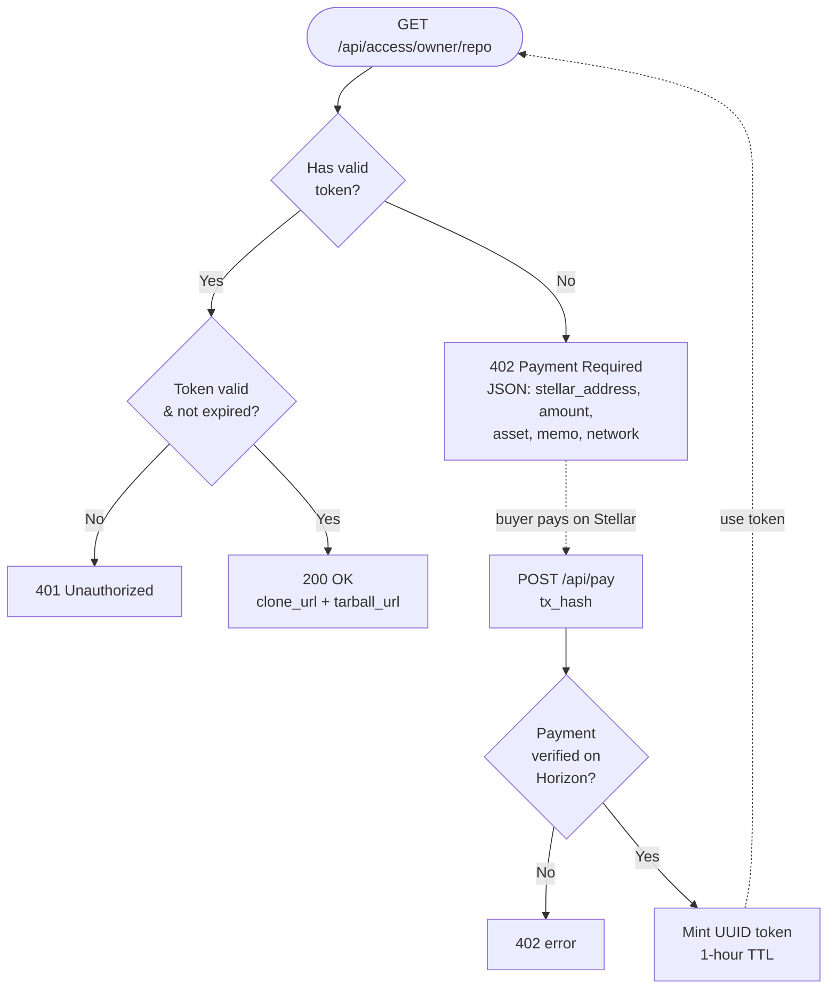

A real `402` response looks like:

```json
{
  "payment_required": true,
  "full_name": "alice/my-toolkit",
  "stellar_address": "GDCD2H...RB3F",
  "amount": "10.00",
  "asset": "XLM",
  "network": "testnet",
  "memo": "alice/my-toolkit",
  "verify_url": "https://.../api/pay"
}
```

### 3b. Two payment paths: native + standard x402

The gateway above is our **native** flow — simple, works for both XLM and USDC, no external dependencies. Alongside it we expose a **second, standards-compliant path** that speaks the official [Stellar x402](https://developers.stellar.org/docs/build/agentic-payments/x402/quickstart-guide) wire format, so any x402-aware agent in the ecosystem can discover and pay for a repo with zero custom integration.

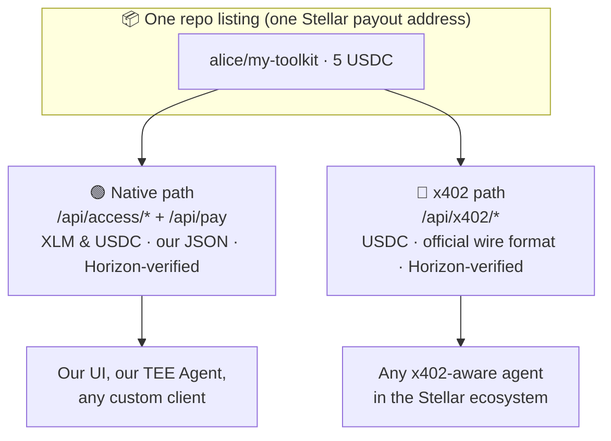

Both doors lead to the same listing and the same payout address. The native path stays the default for the UI (so XLM keeps working and the demo can't break); the x402 path is **purely additive** interoperability.

**How the x402 path works** (`GET /api/x402/{owner}/{repo}`):

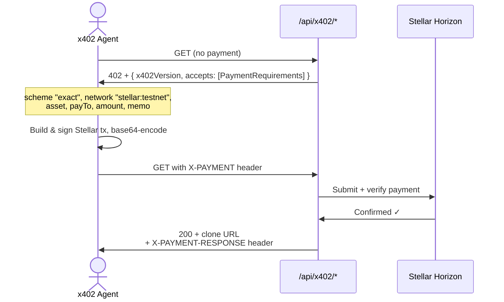

| | Native path | x402 path |
|---|---|---|
| Routes | `/api/access/*`, `/api/pay`, `/api/stellar/*` | `/api/x402/[...path]` |
| Assets | XLM **and** USDC | USDC (XLM also accepted) |
| Wire format | custom JSON | official x402 (`accepts`, `X-PAYMENT`) |
| Types | ours | `@x402/core` (`PaymentRequired`, `PaymentPayload`) |
| Verification | Horizon | Horizon (no external facilitator) |
| Used by | UI, TEE Agent, our clients | any x402-aware agent |

**Design choices that keep it safe:**
- We use the canonical `@x402/core` **types** and base64 header helpers, so the wire shape is the real spec — not an invented one.
- We **verify settlement on Horizon ourselves** rather than depending on a live facilitator, so the path works on testnet standalone and can't be broken by an external outage.
- It's a separate route group — if anything misbehaves, the native flow is untouched and remains the default. Full Soroban-SAC settlement via the official `x402.org` facilitator is a documented drop-in upgrade.

### 4. The TEE Agent

Every page has a floating **TEE Agent** (🫖) panel. It's an LLM with tools that can browse the catalog, list/delist repos, and **purchase repos autonomously** using its own server-side Stellar wallet.

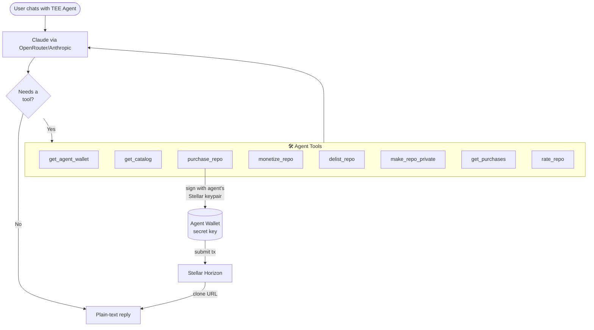

The agent wallet is a **real Stellar keypair** generated server-side. Fund it with XLM/USDC and the agent can buy repos on command — no human signature needed.

### 5. Platform fees

Stellar Bazgit charges a **0.5% deferred fee** on seller earnings. The key idea: **fees never touch the buyer's payment** — money goes straight to the seller. The fee is enforced socially at listing time.

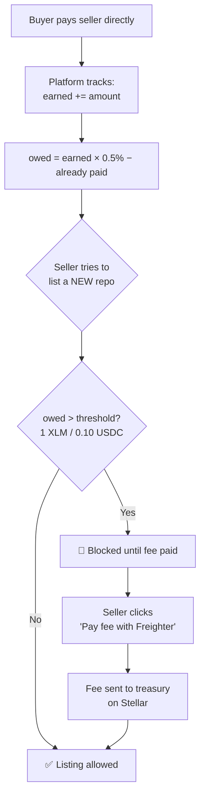

| Property | Value |
|----------|-------|
| Fee rate | 0.5% of seller earnings |
| XLM threshold | 1 XLM owed before listings blocked |
| USDC threshold | 0.10 USDC owed before listings blocked |
| Tracked per asset | XLM and USDC accounted separately |
| Collection | One-click Freighter payment to treasury address |

Existing listings keep working — only **new** listings are gated. Fees are paid via the same one-click Freighter flow as purchases.

### 6. Reviews & merchant ratings

Buyers rate repos 1–5 stars. Crucially, **only verified buyers can review** — the server checks the reviewer's Stellar address against on-chain purchase records before accepting a rating. A **merchant's** overall rating is the aggregate of reviews across all the repos they sell.

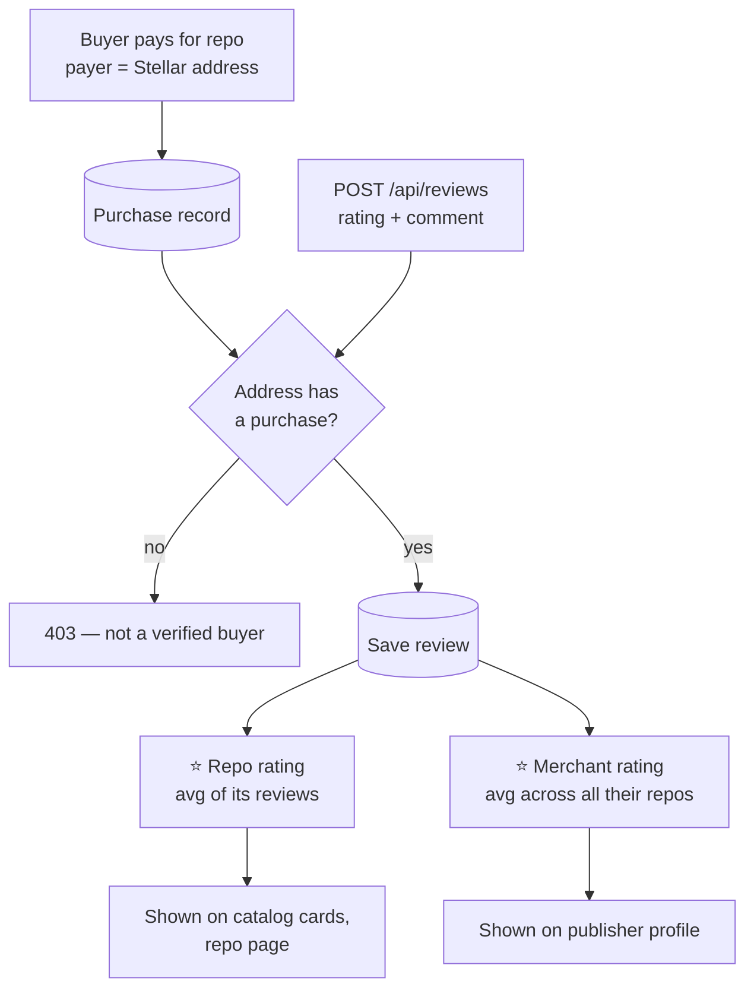

Two ways to leave a review:
- **In the UI** — on a repo page, connect Freighter and submit; your address proves you bought it.
- **Via the TEE Agent** — after the agent buys a repo for you, just say *"leave 5 stars"*. The agent calls `rate_repo`, signing the review with the same wallet that made the purchase, and the new rating appears in the catalog.

Ratings surface everywhere: **catalog cards**, the **repo detail page**, and the **publisher profile** (as the merchant's reputation).

---

## Architecture

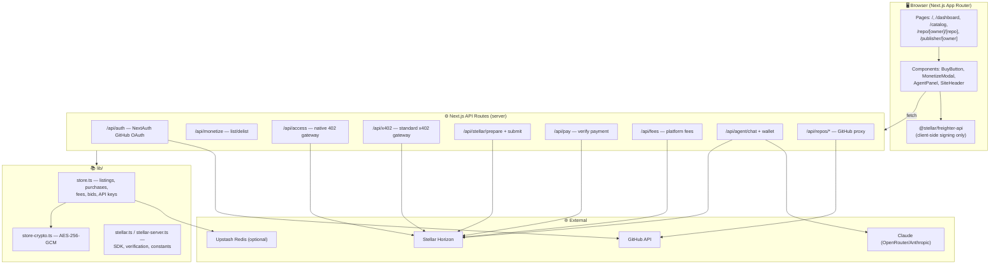

**State persistence:** File-based JSON in `.data/` (dev) with optional Upstash Redis mirror (production). No SQL database required.

---

## TEE & Confidential Compute

The agent is called the **🫖 TEE Agent** for a reason. A **Trusted Execution Environment** is a hardware-isolated enclave where code runs and keys live such that *even the machine's operator cannot read them*. The CPU can produce a signed **attestation** proving exactly which code is running over which secrets.

Stellar itself has **no native TEE** — it's a settlement and DEX layer, not a confidential-compute platform. So the TEE lives on the **operator side**, around the secrets this app must hold:

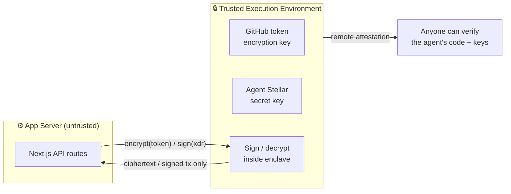

**What we'd protect:**

| Secret | Today | With a TEE |
|--------|-------|------------|
| `TOKEN_ENCRYPTION_KEY` (decrypts GitHub tokens) | env var on the server | sealed in the enclave; host can't read it |
| Agent's Stellar secret key | `.data/agent-wallet.json` | generated & signs **only** inside the enclave |
| Treasury signing | manual | attested, autonomous payouts |

**The pitch:** a TEE Agent can prove — via remote attestation — that the Stellar account it controls is operated *only* by audited code, with a key no human can exfiltrate. That's a genuinely trustless autonomous buyer/seller.

**Implementation options (provider-agnostic):**

- **AWS Nitro Enclaves** — what the original EVM prototype used. KMS-sealed key, PCR0 attestation, vsock channel between host and enclave. Cloud-centralized but battle-tested.
- **Phala Network / Dstack** — decentralized TEE compute (Intel TDX/SGX) purpose-built for hosting AI agents and crypto key custody, with on-chain attestation. The most natural "Web3 TEE agent" fit.
- **Marlin Oyster** — decentralized TEE coprocessor for serverless confidential workloads.
- **Intel TDX / SGX directly** — roll your own enclave if you control the hardware.

**Stellar-native angle:** while Stellar has no enclave primitive, a Soroban contract _could_ gate actions on a published TEE attestation hash — so the on-chain treasury only honours payouts from the attested agent identity. That ties the off-chain TEE guarantee to on-chain enforcement.

> Status: the current build keeps keys in env/`.data` (standard for a hackathon). The architecture is deliberately shaped so the encrypt/sign operations are the *only* things touching secrets — making them a clean drop-in for any of the enclaves above.

---

## Tech Stack

| Layer | Technology |
|-------|------------|
| Framework | Next.js 16 (App Router, Turbopack) |
| UI | React 19, Tailwind CSS v4 |
| Auth | NextAuth v4 + GitHub OAuth |
| Blockchain | Stellar (`@stellar/stellar-sdk`) |
| Agentic payments | x402 standard (`@x402/core`, `@x402/stellar`) |
| Wallet | Freighter (`@stellar/freighter-api`) |
| Payments | XLM + USDC on Stellar, verified via Horizon |
| Token encryption | AES-256-GCM (Node `crypto`) |
| AI Agent | Claude via OpenRouter / Anthropic API |
| Storage | File JSON + optional Upstash Redis |
| Runtime | Bun |

---

## API Reference

| Endpoint | Method | Auth | Purpose |
|----------|--------|------|---------|
| `/api/auth/[...nextauth]` | GET/POST | — | GitHub OAuth |
| `/api/repos` | GET | Session/PAT | List user's GitHub repos |
| `/api/repos/tree` | GET | Session | File tree for granular pricing |
| `/api/repos/readme` | GET | Session | Fetch README for listing |
| `/api/repos/contributors` | GET | Session | Contributors for payout splits |
| `/api/repos/make-private` | POST | Session | Convert public → private |
| `/api/monetize` | GET/POST/DELETE | Session/PAT/Key | Manage listings (fee-gated) |
| `/api/catalog` | GET | Public | Browse all listed repos |
| `/api/access/[...path]` | GET/POST | Token | **402 payment gateway** |
| `/api/stellar/prepare` | POST | Public | Build unsigned purchase tx |
| `/api/stellar/submit` | POST | Public | Submit signed tx, mint token |
| `/api/pay` | POST | Public | Verify a tx hash, mint token |
| `/api/x402/[...path]` | GET | Public | **Standards-compliant x402 gateway** (402 + `X-PAYMENT`) |
| `/api/purchases` | GET | Public | Purchase history per repo |
| `/api/reviews` | GET/POST | Public | Verified-purchase reviews + ratings |
| `/api/bids` | GET/POST/PATCH | Mixed | Make/manage offers |
| `/api/fees` | GET/POST | Session | Fee summary + pay fee |
| `/api/fees/prepare` | POST | Session | Build unsigned fee tx |
| `/api/keys` | GET/POST/DELETE | Session | API keys (`sbz_...`) for agents |
| `/api/agent/chat` | POST | Public | TEE Agent conversation loop |
| `/api/agent/wallet` | GET/POST/DELETE | Public | Agent Stellar wallet |
| `/api/listing/generate` | POST | Session | AI-generated listing copy |

---

## Project Structure

```
stellar-bazgit-hack/
├── app/
│   ├── page.tsx                    # Landing / sign-in
│   ├── dashboard/page.tsx          # Seller dashboard (+ fees, API keys, bids)
│   ├── catalog/page.tsx            # Public catalog browser
│   ├── repo/[owner]/[repo]/        # Repo detail + buy flow
│   ├── publisher/[owner]/          # Seller profile + their repos
│   ├── components/
│   │   ├── BuyButton.tsx           # Freighter purchase flow
│   │   ├── MonetizeModal.tsx       # List/edit a repo
│   │   ├── AgentPanel.tsx          # TEE Agent chat sidebar + FAB
│   │   ├── AgentWalletWidget.tsx   # Agent wallet status
│   │   └── SiteHeader.tsx          # Shared header
│   └── api/                        # All API routes (see table above)
├── lib/
│   ├── auth.ts                     # NextAuth config
│   ├── store.ts                    # State: listings, purchases, fees, bids
│   ├── store-crypto.ts             # AES-256-GCM token encryption
│   ├── stellar.ts                  # Client-safe Stellar helpers + verification
│   ├── stellar-server.ts           # Server-only SDK re-exports
│   └── x402.ts                     # x402 wire-format helpers (@x402/core types)
├── mcp/
│   └── server.ts                   # MCP server for Claude Desktop (stdio)
└── .data/                          # JSON persistence (gitignored)
```

---

## Getting Started

### Prerequisites

- [Bun](https://bun.sh)
- A [GitHub OAuth App](https://github.com/settings/developers)
- A Stellar account (testnet works — fund it at [friendbot](https://friendbot.stellar.org))
- The [Freighter](https://www.freighter.app) browser extension

### Setup

```bash
# Install dependencies
bun install

# Configure environment
cp .env.local.example .env.local
# Fill in the values below
```

### Environment variables

```bash
# NextAuth — openssl rand -hex 32
NEXTAUTH_SECRET=...
NEXTAUTH_URL=http://localhost:3000

# GitHub OAuth App
GITHUB_CLIENT_ID=...
GITHUB_CLIENT_SECRET=...

# AES-256-GCM key for GitHub token encryption — openssl rand -hex 32
TOKEN_ENCRYPTION_KEY=...

# Stellar network: "testnet" or "mainnet"
STELLAR_NETWORK=testnet
NEXT_PUBLIC_STELLAR_NETWORK=testnet

# Treasury address that collects platform fees
STELLAR_TREASURY_ADDRESS=G...

# AI agent (one of these)
OPENROUTER_API_KEY=...          # or ANTHROPIC_API_KEY

# Optional: persistent storage
KV_REST_API_URL=...
KV_REST_API_TOKEN=...
```

### Run

```bash
bun run dev      # http://localhost:3000
bun run build    # production build
bun run start    # serve production build
```

---

## Deploying to Production

See `.env.production.example` for the full template. Production differs from dev in three important ways:

**1. A separate GitHub OAuth App.** Create a *new* app (don't reuse the dev one) at [github.com/settings/developers](https://github.com/settings/developers):

| Field | Value |
|-------|-------|
| Homepage URL | `https://your-domain.com` |
| Authorization callback URL | `https://your-domain.com/api/auth/callback/github` |

Then *Generate a new client secret* and set `GITHUB_CLIENT_ID` / `GITHUB_CLIENT_SECRET`.

**2. Fresh secrets** (never reuse dev values):

```bash
openssl rand -base64 32   # → NEXTAUTH_SECRET
openssl rand -hex 32      # → TOKEN_ENCRYPTION_KEY  (64 hex chars)
```

`NEXTAUTH_URL` must be the exact public URL (`https://your-domain.com`). Changing `TOKEN_ENCRYPTION_KEY` later makes already-stored GitHub tokens unreadable.

**3. Redis is required.** Serverless filesystems are ephemeral, so the `.data/*.json` fallback won't persist between requests. Create a free [Upstash](https://console.upstash.com) database and set `KV_REST_API_URL` + `KV_REST_API_TOKEN`. All state (listings, purchases, reviews, fees, API keys, agent wallet) then lives in Redis.

Set `STELLAR_NETWORK` / `NEXT_PUBLIC_STELLAR_NETWORK` to `mainnet` for real payments, and point `STELLAR_TREASURY_ADDRESS` at your fee-collection account. The full production checklist lives in `.env.production.example`.

---

## Security Model

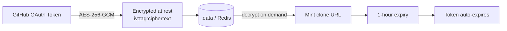

- **GitHub tokens** are encrypted with AES-256-GCM before storage; the key lives only in `TOKEN_ENCRYPTION_KEY`.
- **Clone URLs** embed the token but expire after 1 hour — buyers clone once, then the link dies.
- **Buyer keys never leave Freighter** — the server only ever handles unsigned and signed XDR, never secret keys.
- **Payments are verified on-chain** — the server checks the actual Horizon transaction (destination, amount, asset) before granting access. No trust in client claims.
- **Agent wallet** secret key is stored server-side; fund it only with what you're willing to let the agent spend.

---

<div align="center">

**Built on ⭐ Stellar** · 2–5s settlement · sub-cent fees · powered by the 🫖 TEE Agent

</div>
