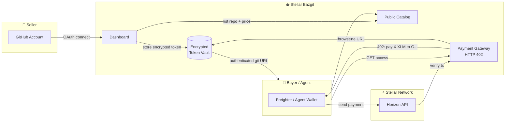
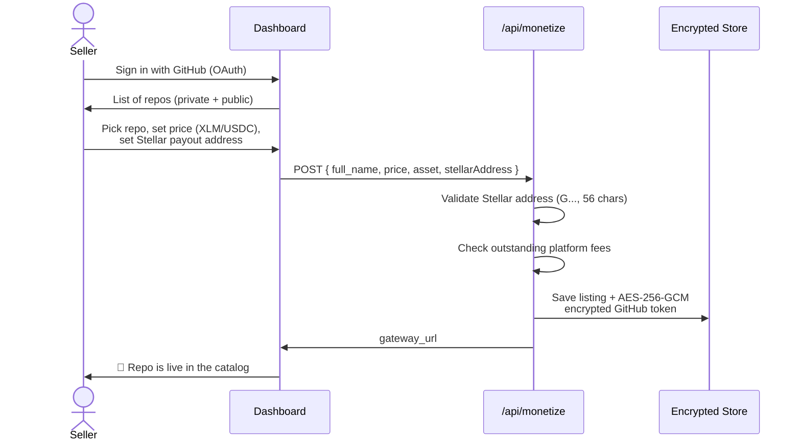
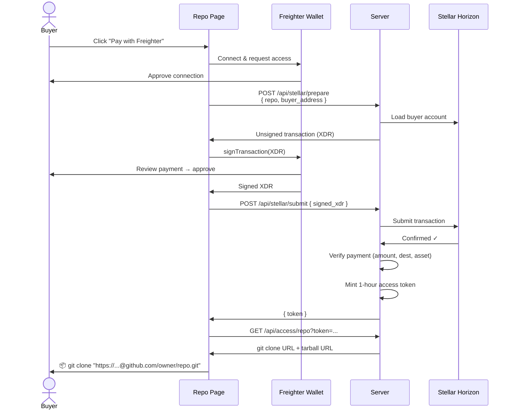
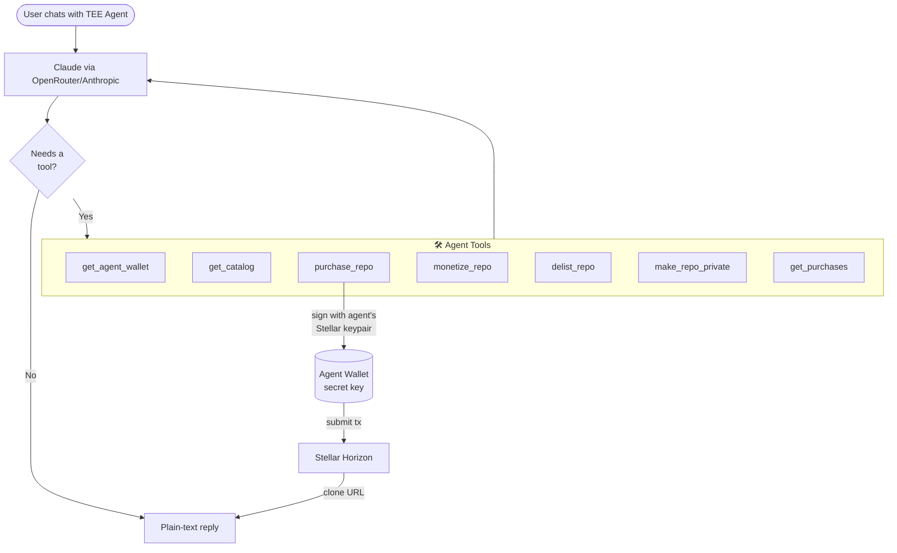
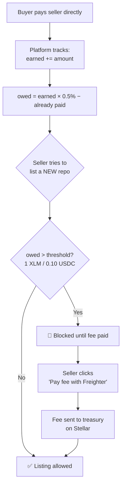
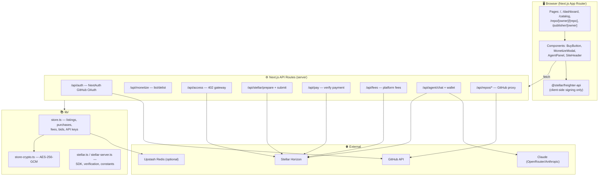
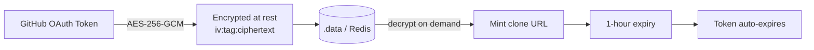

# 🫖 Stellar Bazgit

**The Stellar-native marketplace for private GitHub repositories.**

Sell access to your private repos. Get paid in **XLM** or **USDC** on the [Stellar](https://stellar.org) network. Buyers pay once, get a time-limited `git clone` URL. AI agents can browse, buy, and list repos autonomously.

> Think of it as a paywall gateway in front of any private GitHub repo — settlement in 2–5 seconds, sub-cent fees, no credit cards, no middlemen holding your money.

---

## Table of Contents

- [What is this?](#what-is-this)
- [The Big Picture](#the-big-picture)
- [How It Works](#how-it-works)
  - [1. Selling a repo](#1-selling-a-repo)
  - [2. Buying a repo](#2-buying-a-repo)
  - [3. The payment gateway (HTTP 402)](#3-the-payment-gateway-http-402)
  - [4. The TEE Agent](#4-the-tee-agent)
  - [5. Platform fees](#5-platform-fees)
- [Architecture](#architecture)
- [Tech Stack](#tech-stack)
- [API Reference](#api-reference)
- [Project Structure](#project-structure)
- [Getting Started](#getting-started)
- [Security Model](#security-model)

---

## What is this?

GitHub has no native way to **sell** access to a private repository. You either add someone as a collaborator (manual, free) or you don't.

Stellar Bazgit turns any private repo into a **pay-to-clone product**:

| Role | What they do |
|------|--------------|
| **Seller** | Connects GitHub, picks a private repo, sets a price in XLM/USDC, gets a shareable gateway URL |
| **Buyer** | Visits the listing, pays with a Stellar wallet, instantly receives an authenticated `git clone` URL |
| **AI Agent** | Discovers repos via a public API, pays autonomously from its own Stellar wallet, clones the code |

The seller's GitHub token is encrypted at rest. When a buyer pays, the server mints a short-lived clone URL using that token — the buyer never sees the raw credential, and access expires after 1 hour.

---

## The Big Picture



---

## How It Works

### 1. Selling a repo

A seller authenticates with GitHub (OAuth, scoped to `repo` access), then picks a repository to monetize.



**Pricing modes:**
- **Flat** — one price unlocks the whole repo
- **Per-file / per-folder** — granular rules, each path priced independently

**Payout options:**
- **Single address** — all payments to one Stellar account
- **Split by contributors** — define shares per GitHub contributor (each with their own Stellar address)

### 2. Buying a repo

The buyer pays directly to the seller's Stellar address using the **Freighter** browser wallet. The whole flow is one button click.



> **Why build the transaction on the server?** The Stellar SDK pulls in Node.js-only modules that don't bundle for the browser. So the server constructs the unsigned transaction; the browser only signs it via Freighter. The buyer's secret key never leaves their wallet.

### 3. The payment gateway (HTTP 402)

The gateway speaks the standard **`402 Payment Required`** status code. Hit any monetized repo's access endpoint without a token, and you get back machine-readable payment instructions — perfect for scripts and agents.


A real `402` response looks like:

```json
{
  "payment_required": true,
  "full_name": "alice/my-toolkit",
  "stellar_address": "GDCD2H...RB3F",
  "amount": "10.00",
  "asset": "XLM",
  "network": "testnet",
  "memo": "alice/my-toolkit",
  "verify_url": "https://.../api/pay"
}
```

### 4. The TEE Agent

Every page has a floating **TEE Agent** (🫖) panel. It's an LLM with tools that can browse the catalog, list/delist repos, and **purchase repos autonomously** using its own server-side Stellar wallet.



The agent wallet is a **real Stellar keypair** generated server-side. Fund it with XLM/USDC and the agent can buy repos on command — no human signature needed.

### 5. Platform fees

Stellar Bazgit charges a **0.5% deferred fee** on seller earnings. The key idea: **fees never touch the buyer's payment** — money goes straight to the seller. The fee is enforced socially at listing time.



| Property | Value |
|----------|-------|
| Fee rate | 0.5% of seller earnings |
| XLM threshold | 1 XLM owed before listings blocked |
| USDC threshold | 0.10 USDC owed before listings blocked |
| Tracked per asset | XLM and USDC accounted separately |
| Collection | One-click Freighter payment to treasury address |

Existing listings keep working — only **new** listings are gated. Fees are paid via the same one-click Freighter flow as purchases.

---

## Architecture



**State persistence:** File-based JSON in `.data/` (dev) with optional Upstash Redis mirror (production). No SQL database required.

---

## Tech Stack

| Layer | Technology |
|-------|------------|
| Framework | Next.js 16 (App Router, Turbopack) |
| UI | React 19, Tailwind CSS v4 |
| Auth | NextAuth v4 + GitHub OAuth |
| Blockchain | Stellar (`@stellar/stellar-sdk`) |
| Wallet | Freighter (`@stellar/freighter-api`) |
| Payments | XLM + USDC on Stellar, verified via Horizon |
| Token encryption | AES-256-GCM (Node `crypto`) |
| AI Agent | Claude via OpenRouter / Anthropic API |
| Storage | File JSON + optional Upstash Redis |
| Runtime | Bun |

---

## API Reference

| Endpoint | Method | Auth | Purpose |
|----------|--------|------|---------|
| `/api/auth/[...nextauth]` | GET/POST | — | GitHub OAuth |
| `/api/repos` | GET | Session/PAT | List user's GitHub repos |
| `/api/repos/tree` | GET | Session | File tree for granular pricing |
| `/api/repos/readme` | GET | Session | Fetch README for listing |
| `/api/repos/contributors` | GET | Session | Contributors for payout splits |
| `/api/repos/make-private` | POST | Session | Convert public → private |
| `/api/monetize` | GET/POST/DELETE | Session/PAT/Key | Manage listings (fee-gated) |
| `/api/catalog` | GET | Public | Browse all listed repos |
| `/api/access/[...path]` | GET/POST | Token | **402 payment gateway** |
| `/api/stellar/prepare` | POST | Public | Build unsigned purchase tx |
| `/api/stellar/submit` | POST | Public | Submit signed tx, mint token |
| `/api/pay` | POST | Public | Verify a tx hash, mint token |
| `/api/purchases` | GET | Public | Purchase history per repo |
| `/api/bids` | GET/POST/PATCH | Mixed | Make/manage offers |
| `/api/fees` | GET/POST | Session | Fee summary + pay fee |
| `/api/fees/prepare` | POST | Session | Build unsigned fee tx |
| `/api/keys` | GET/POST/DELETE | Session | API keys (`sbz_...`) for agents |
| `/api/agent/chat` | POST | Public | TEE Agent conversation loop |
| `/api/agent/wallet` | GET/POST/DELETE | Public | Agent Stellar wallet |
| `/api/listing/generate` | POST | Session | AI-generated listing copy |

---

## Project Structure

```
stellar-bazgit-hack/
├── app/
│   ├── page.tsx                    # Landing / sign-in
│   ├── dashboard/page.tsx          # Seller dashboard (+ fees, API keys, bids)
│   ├── catalog/page.tsx            # Public catalog browser
│   ├── repo/[owner]/[repo]/        # Repo detail + buy flow
│   ├── publisher/[owner]/          # Seller profile + their repos
│   ├── components/
│   │   ├── BuyButton.tsx           # Freighter purchase flow
│   │   ├── MonetizeModal.tsx       # List/edit a repo
│   │   ├── AgentPanel.tsx          # TEE Agent chat sidebar + FAB
│   │   ├── AgentWalletWidget.tsx   # Agent wallet status
│   │   └── SiteHeader.tsx          # Shared header
│   └── api/                        # All API routes (see table above)
├── lib/
│   ├── auth.ts                     # NextAuth config
│   ├── store.ts                    # State: listings, purchases, fees, bids
│   ├── store-crypto.ts             # AES-256-GCM token encryption
│   ├── stellar.ts                  # Client-safe Stellar helpers + verification
│   └── stellar-server.ts           # Server-only SDK re-exports
└── .data/                          # JSON persistence (gitignored)
```

---

## Getting Started

### Prerequisites

- [Bun](https://bun.sh)
- A [GitHub OAuth App](https://github.com/settings/developers)
- A Stellar account (testnet works — fund it at [friendbot](https://friendbot.stellar.org))
- The [Freighter](https://www.freighter.app) browser extension

### Setup

```bash
# Install dependencies
bun install

# Configure environment
cp .env.local.example .env.local
# Fill in the values below
```

### Environment variables

```bash
# NextAuth — openssl rand -hex 32
NEXTAUTH_SECRET=...
NEXTAUTH_URL=http://localhost:3000

# GitHub OAuth App
GITHUB_CLIENT_ID=...
GITHUB_CLIENT_SECRET=...

# AES-256-GCM key for GitHub token encryption — openssl rand -hex 32
TOKEN_ENCRYPTION_KEY=...

# Stellar network: "testnet" or "mainnet"
STELLAR_NETWORK=testnet
NEXT_PUBLIC_STELLAR_NETWORK=testnet

# Treasury address that collects platform fees
STELLAR_TREASURY_ADDRESS=G...

# AI agent (one of these)
OPENROUTER_API_KEY=...          # or ANTHROPIC_API_KEY

# Optional: persistent storage
KV_REST_API_URL=...
KV_REST_API_TOKEN=...
```

### Run

```bash
bun run dev      # http://localhost:3000
bun run build    # production build
bun run start    # serve production build
```

---

## Security Model



- **GitHub tokens** are encrypted with AES-256-GCM before storage; the key lives only in `TOKEN_ENCRYPTION_KEY`.
- **Clone URLs** embed the token but expire after 1 hour — buyers clone once, then the link dies.
- **Buyer keys never leave Freighter** — the server only ever handles unsigned and signed XDR, never secret keys.
- **Payments are verified on-chain** — the server checks the actual Horizon transaction (destination, amount, asset) before granting access. No trust in client claims.
- **Agent wallet** secret key is stored server-side; fund it only with what you're willing to let the agent spend.

---

<div align="center">

**Built on ⭐ Stellar** · 2–5s settlement · sub-cent fees · powered by the 🫖 TEE Agent

</div>
